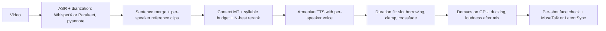

# English to Eastern Armenian dubbing: audit, research, plan

Date: 2026-10-07. Scope: English source, Eastern Armenian (`hye`) target, TV pilots
(multi-speaker, emotional, close-ups), **commercial use**. Paid APIs appear only as
optional comparison rows. The test notebook is
[`notebooks/colab_dubbing_ablation.ipynb`](../../notebooks/colab_dubbing_ablation.ipynb).

## Summary

1. Today the pipeline does not clone voices or lip-sync. The Fish-Speech loader is a placeholder and the Fish-Speech and MuseTalk CLI calls are wrong, so every run produces edge-tts stock voices over the original video.
2. The quality metrics in `scripts/evaluation/metrics` for lip sync and COMET are mocks (`np.random`, a fixed `0.85`). No number reported so far can be trusted.
3. For commercial TV the stack has a license problem: SeamlessM4T (CC-BY-NC), Fish-Speech S2 (research license), and CodeFormer (S-Lab NC) cannot ship.
4. The biggest quality gaps for TV are: no diarization (one voice for every character), translation with no context or length control, and a timing step that cuts or overlaps lines.
5. Best open Armenian TTS found: OmniVoice (Armenian FLEURS CER 1.45 vs 1.38 for real recordings; it has a `duration=` control). Its weights are CC-BY-NC, so it is only a quality ceiling for commercial use.
6. Commercial TTS options: Azure `hy-AM` voices plus OpenVoice v2 timbre conversion (MIT); a Chatterbox (MIT) fine-tune on CC0 Common Voice Armenian; or the paid Fish Audio API.
7. Commercial MT options: TranslateGemma (Gemma terms) or MADLAD-400 (Apache), with a duration-aware rewrite step. Gemini is an optional API row.
8. Lip sync: MuseTalk 1.5 (MIT) fits the free T4. LatentSync 1.6 (Apache, 18 GB) needs a paid GPU. InfiniteTalk (Apache, 14B base) is an A100-only experiment.
9. ASR for this task is English, not Armenian. The Armenian Whisper LoRA effort belongs in evaluation (back-transcription), where an NVIDIA Armenian model is stronger.
10. Order of work: fix integrations and metrics, add diarization, then TTS, MT duration control, timing, lip sync, and mix.

---

## Task 1: Codebase audit

Line numbers refer to the current `main` (commit `c38d7a3`).

### High priority

| # | Finding | Where | Effect |
|---|---------|-------|--------|
| H1 | Fish-Speech is never loaded. `_load_fish_speech` imports two classes and then sets `self.model = {"loaded": True}`. `_synthesize_fish_speech` calls `python -m fish_speech.inference --text --reference-audio --emotion`, which is not a Fish-Speech entry point. On a non-zero exit it falls back to edge-tts silently. | `src/inference.py` 550-659 | No voice cloning ever runs. Every speaker gets `hy-AM-AnahitNeural` or `hy-AM-HaykNeural`. |
| H2 | MuseTalk call is wrong. It runs `python -m musetalk.inference --video_path --audio_path --output_path` and then `musetalk/real_time_inference.py`. Neither exists in MuseTalk 1.5. The real call is `python -m scripts.inference --inference_config <yaml> --result_dir <dir> --unet_model_path models/musetalkV15/unet.pth --unet_config models/musetalkV15/musetalk.json --version v15`, and it reads inputs from a YAML file, not from flags. | `src/inference.py` 920-991 | Lip sync always returns `status: skipped`. The output is the original video with new audio. |
| H3 | Metrics are mocks. `_extract_mouth_movements` returns `np.random.rand(300)`. `compute_lse_c_metric` returns `1.2` without OpenCV. `compute_comet_score` returns `scores = [0.85]` and never calls the COMET model. The MOS "proxy" is a hand-made heuristic. | `scripts/evaluation/metrics/lipsync_metrics.py` 64-70, 248-283; `translation_metrics.py` 111-136; `mos_proxy_metrics.py` | Every reported LSE, COMET, and MOS number is meaningless. Regression tests built on them cannot catch anything. |
| H4 | No speaker diarization. One `reference_speaker_audio` and one `emotion` are used for all segments. | `src/pipeline/pipeline.py` 284-289, 379-417 | In a TV pilot every character speaks with the same voice. This is the most visible failure for the use case. |
| H5 | ASR is configured for Armenian while the input is English. `asr.whisper.model_path: models/asr/whisper-large-v3-armenian`, `language: hy`. The pipeline overrides the language with `src_lang`, but it would still load the Armenian LoRA if one existed. `models/` is empty, so no adapter is shipped. `return_timestamps=True` gives chunk timestamps, not word timestamps. `vad_filter`, `word_timestamps`, and `beam_size` are never read. | `configs/config.yaml` 16-24; `src/inference.py` 129-216 | Segment boundaries come from 30 s chunk decoding, so lines drift and split mid-sentence. No VAD means hallucinations on music and silence. |
| H6 | Failed translations are spoken in English. On an exception `translate()` returns `{"tgt_text": text}`, which is the English source. `DIALECT_MAP` sends `western` to `hyw`, which SeamlessM4T does not support, so Western Armenian always takes this path. | `src/inference.py` 422-424; `src/pipeline/pipeline.py` 55-60 | Armenian TTS reads English text. The output sounds broken and no error is raised. |
| H7 | Licenses block commercial use. The SeamlessM4T v2 weights are CC-BY-NC 4.0. Fish-Speech S2 Pro is under the Fish Audio Research License (commercial use needs a separate license). CodeFormer (`video.codeformer`, `lipsync.face_enhancement: true`) is under the S-Lab License 1.0 (non-commercial). The edge-tts package uses the Edge "read aloud" endpoint, which has no commercial terms. | `configs/config.yaml` 31-58, 69, 86-89; `src/inference.py` 661-771 | The current production path cannot be used for paid TV distribution. |

### Medium priority

| # | Finding | Where | Effect |
|---|---------|-------|--------|
| M1 | The stretch clamp is ignored. `ratio` is clamped to `[min_compress_ratio, max_stretch_ratio]`, but `time_stretch_audio` receives the unclamped `target_duration` and only clamps to 0.5-2.0. Placement uses `output[a:b] = audio`, so a long segment overwrites the start of the next one. There is no crossfade (`crossfade_ms` is never read) and no use of free time in adjacent silences. | `src/pipeline/pipeline.py` 446-483; `src/utils/helpers.py` 227-229 | Up to 2x tempo changes, words clipped at the next line, and clicks at boundaries. |
| M2 | Short lines are deleted. `_is_hallucinated` returns `True` for any text under 10 characters. If the full transcript is short, all segments are blanked. | `src/inference.py` 232-241, 307-317 | "No!", "Yes.", and "Run!" disappear. TV dialogue has many of these. |
| M3 | Translation is per chunk with no context. Each Whisper chunk is translated alone, with no surrounding sentences, no speaker or gender information (Armenian verb and pronoun agreement, formal vs informal "you"), and no length target. | `src/inference.py` 426-461 | Broken sentences, wrong register, and lines that do not fit their time slot. |
| M4 | The audio mix is wrong. Accompaniment is mixed at `sfx_weight=0.2`, which is about -14 dB, so music and effects almost vanish. Demucs `htdemucs_ft` runs on CPU on a mono signal copied to 2 channels and keeps channel 0 only. A crude amplitude gate (`denoise_audio`) runs on clean TTS output. Loudness is normalized before the mix, so the final level is not -14 LUFS. | `src/pipeline/pipeline.py` 487-521; `src/inference.py` 1028-1124 | Thin, dry speech over a quiet bed. Slow (CPU htdemucs_ft is a bag of 4 models). |
| M5 | Consent is logged automatically. Every run with a reference clip writes `consent_given=True` with no user input. | `src/pipeline/pipeline.py` 232-238 | The consent log is not evidence of consent. This is a legal risk for voice cloning of actors. |
| M6 | Watermark text is not escaped. `watermark_text` goes straight into the FFmpeg `drawtext=text='...'` filter. A `'` or `:` breaks the filter, and the string is configurable (filter injection). | `src/pipeline/pipeline.py` 565-573 | Encoding fails, and the error path returns the input video path as if it were the output. |
| M7 | Whisper is quantized to 4-bit with a LoRA merge. With `enable_quantization: true`, Whisper is loaded with NF4 `device_map="auto"`, and `merge_and_unload()` is applied on a 4-bit base. That path is fragile in PEFT, and NF4 slows Whisper and degrades timestamps. Whisper large-v3 needs about 3 GB in fp16. | `src/inference.py` 94-153; `configs/config.yaml` 160-162 | Slower, less accurate ASR for no memory benefit on any GPU here. |
| M8 | The emotion tag is global and is not used by Fish-Speech. `emotion` is one value per video. In edge-tts it maps to fixed rate and pitch offsets that also change duration, which then gets stretched back. | `src/inference.py` 693-702 | Emotion control fights duration control. |

### Low priority

| # | Finding | Where |
|---|---------|-------|
| L1 | `get_gpu_memory_info` uses `props.total_mem`. The attribute is `total_memory`, so `free_gpu_memory()` raises inside its log call. The error is swallowed by `_maybe_unload`. | `src/utils/helpers.py` 123, 130-135 |
| L2 | The extracted-audio cache is keyed by `video_path.stem`, so two different videos named `ep1.mp4` reuse stale audio. | `src/pipeline/pipeline.py` 344-352 |
| L3 | `fps=25` is hard-coded for lip sync. TV material is often 23.976, 24, or 29.97 fps. | `src/inference.py` 884 |
| L4 | `eval(video_stream["r_frame_rate"])` parses ffprobe output with `eval`. | `src/utils/helpers.py` 82 |
| L5 | Rubberband uses `--crisp 5`, a percussive setting. For speech, the R3 engine (`--fine`) or `--crisp 3` with `--formant` sounds better. | `src/utils/helpers.py` 237-244 |
| L6 | `-shortest` in the final mux can cut the video tail when the audio is shorter. | `src/pipeline/pipeline.py` 595 |
| L7 | The repo-wide temp dir `outputs/temp` is shared between parallel jobs (`batch_video_max_concurrent: 2`), and files such as `final_audio.wav` collide. | `src/pipeline/pipeline.py` 560 |
| L8 | Per-segment file round trips (save WAV, call rubberband, load) for every segment. This is slow for 500+ line episodes. | `src/pipeline/pipeline.py` 456-466 |

---

## Task 2: Research (state of the art, October 2026)

Legend: **V** = verified from the primary source (model card, repo README, or paper) during this review. **U** = unverified; treat it with caution. VRAM is for inference.

### 2.1 Speech recognition

For this project the source is English, so English ASR quality and word timestamps matter most. Armenian ASR is needed only to **evaluate** the dubbed audio (back-transcription CER).

| Method | Source | License | VRAM | Fit for this project | Status |
|---|---|---|---|---|---|
| Whisper large-v3-turbo + WhisperX forced alignment | [openai/whisper](https://github.com/openai/whisper), [m-bain/whisperX](https://github.com/m-bain/whisperX) | MIT (Whisper), BSD-2 (WhisperX) | about 3-6 GB fp16 | Best robust English ASR on noisy TV audio. WhisperX adds VAD and wav2vec2 word alignment. **Recommended primary.** | V (license), U (exact VRAM) |
| Parakeet-TDT-0.6b-v2 (English) / v3 (25 EU languages) | [nvidia/parakeet-tdt-0.6b-v3](https://huggingface.co/nvidia/parakeet-tdt-0.6b-v3) | CC-BY-4.0 | about 2-4 GB | Native word, segment, and char timestamps, punctuation. Avg Open ASR Leaderboard WER 6.34% (v3). Fast. Good alternative. **No Armenian.** | V |
| pyannote `speaker-diarization-community-1` | [HF card](https://huggingface.co/pyannote/speaker-diarization-community-1) | CC-BY-4.0, gated | about 1-2 GB | Open diarization baseline. Has an "exclusive" one-speaker-per-segment mode that makes it easy to join with ASR words. Reported DER: AMI IHM 17.0, DIHARD3 20.2 (secondary source). | V (license), U (DER figures) |
| MOSS-Transcribe-Diarize 0.9B | [HF card](https://huggingface.co/OpenMOSS-Team/MOSS-Transcribe-Diarize) | Apache-2.0 | U | One model for ASR, diarization, and timestamps. Newer and less tested than WhisperX plus pyannote. | V (license), U (quality on TV) |
| NVIDIA `stt_hy_fastconformer_hybrid_large_pc` | [HF card](https://huggingface.co/nvidia/stt_hy_fastconformer_hybrid_large_pc) | CC-BY-4.0 | about 1-2 GB | **Armenian.** Best open model on ArmBench-ASR (combined WER 20.21%; Common Voice 7.70%). Used here as the **back-ASR judge** for dubbed audio. | V (model and license), V (ArmBench numbers, [blog](https://huggingface.co/blog/Metric-AI/armbench-asr)) |
| Whisper large-v3 (zero-shot Armenian) | [Interspeech 2025, Karpov et al.](https://www.isca-archive.org/interspeech_2025/karpov25_interspeech.pdf) | MIT | about 3 GB | 54.17% WER on Common Voice Armenian, 23.32% on FLEURS. Weak without fine-tuning. The repo's LoRA work targets this, but it is not on the dubbing path. | V |
| Omnilingual ASR (Meta) | [arXiv 2511.09690](https://arxiv.org/abs/2511.09690) | U | U | 1600+ languages. No Armenian-specific result found. | U |

ArmBench-ASR (August 2026) shows every model's highest WER on **movie** audio (median 61.87%). Back-ASR CER on dubbed TV audio will therefore be noisy, so use it to **compare** systems, not as an absolute score.

### 2.2 Machine translation (English to Eastern Armenian)

| Method | Source | License | VRAM | Fit | Status |
|---|---|---|---|---|---|
| SeamlessM4T v2 Large (current) | [HF card](https://huggingface.co/facebook/seamless-m4t-v2-large) | **CC-BY-NC 4.0** | about 5-6 GB fp16 | Supports `hye` text output. **Not usable commercially.** Keep as a baseline row only. **No `hyw`.** | V |
| NLLB-200 3.3B | [facebook/nllb-200-3.3B](https://huggingface.co/facebook/nllb-200-3.3B) | **CC-BY-NC 4.0** | about 7 GB fp16 | chrF++ 52.8 en-hy in one WMT26 local evaluation. Non-commercial. | V (license), U (score, single source) |
| TranslateGemma 4B / 12B / 27B | [blog](https://blog.google/innovation-and-ai/technology/developers-tools/translategemma/), [arXiv 2601.09012](https://arxiv.org/abs/2601.09012) | Gemma Terms of Use (commercial OK with use policy) | 4B: about 8 GB fp16 / 3 GB 4-bit. 12B: about 24 GB bf16 / 8 GB 4-bit | **Armenian is only in the synthetic-data extension**, not among the 55 evaluated languages. chrF++ 50.1 (12B) in the WMT26 local evaluation. **Recommended commercial primary.** | V (license, Armenian in the synthetic list), U (score) |
| MADLAD-400 3B / 7B / 10B | [google/madlad400-10b-mt](https://huggingface.co/google/madlad400-10b-mt) | Apache-2.0 | 3B: about 6 GB bf16. 10B: about 20 GB bf16 | Supports `hy` via the `<2hy>` prefix. chrF++ 50.3 (10B) in the WMT26 local evaluation. T5 models overflow in fp16 on T4, so use 8-bit or fp32. | V (license, language), U (score) |
| WMT26 constrained submission (8B) | [foksly/wmt26-constrained-submission](https://huggingface.co/foksly/wmt26-constrained-submission) | "See LICENSE", not checked | about 16 GB bf16 | Best en-hy chrF++ in the submitter's own table (53.5). License unknown, so do not adopt until checked. | U |
| Gemini (API) | [ArmBench-LLM 1.0](https://huggingface.co/blog/Metric-AI/armbench-llm) | Commercial API | n/a | ArmBench-LLM names Gemini 3 Flash the most accurate translator. Optional API row. Strong at instructions such as length limits and register. | V (benchmark claim), U (exact model id to use) |

All chrF++ figures above come from **one** submitter's local evaluation (not official WMT26 scores), so they are marked U. WMT26 added English to Armenian as a new direction ([findings](https://www2.statmt.org/wmt26/pdf/2026.wmt-1.48.pdf)). Official human rankings exist there, but I did not extract en-hy rows from the PDF.

**Duration-aware translation.** No method below has published Armenian results. All of them are language-agnostic in design.

| Method | Source | License | Fit | Status |
|---|---|---|---|---|
| Duration-based Translation: predict a phoneme budget from source duration and TTS rate, then iteratively shorten or lengthen with an LLM | [EMNLP 2025 demo](https://aclanthology.org/2025.emnlp-demos.37.pdf) | paper | Directly usable as a prompt loop. Up to 24% relative speech-overlap gain on en/es/ko with competitive COMET. | V |
| Length-control prompting for isometric MT | [IWSLT 2025](https://aclanthology.org/2025.iwslt-1.11.pdf) | paper | Practical: instructions plus *extreme* short examples plus N-best selection. Tested on en-de/fr/es only. | V |
| SSPO (segment preference optimization) | [ACL 2025](https://aclanthology.org/2025.acl-long.227.pdf) | paper | Needs DPO training data. Phase 2. | V |
| HOMURA (RL with a syllable-ratio reward) | [arXiv 2601.10187](https://arxiv.org/abs/2601.10187) | paper | Needs RL training. Phase 2. | V |
| DuraS2ST | [arXiv 2609.33742](https://arxiv.science/abs/2609.33742) | U | Speech-to-speech with duration planning. No Armenian. Research only. | U |

### 2.3 Zero-shot and few-shot voice cloning with accent control

| Method | Source | License | VRAM | Armenian? | Fit | Status |
|---|---|---|---|---|---|---|
| OmniVoice (0.6B, diffusion-LM) | [GitHub](https://github.com/k2-fsa/OmniVoice), [arXiv 2604.00688](https://arxiv.org/abs/2604.00688) | Code Apache-2.0, **weights CC-BY-NC** | U (0.6B; consumer GPU) | **Yes**: 42.15 h of training data, FLEURS CER 1.45 vs ground truth 1.38 | Best Armenian quality found. Has `duration=` (fixed output length) and `speed=`. The README states that **cross-lingual cloning carries the reference language's accent**. **Research ceiling only** (NC). Some blogs say "Apache-2.0 commercial OK"; the HF card contradicts this. | V |
| Fish Audio S2 Pro (open weights) / S2.1-Pro (API) | [fishaudio/s2-pro](https://huggingface.co/fishaudio/s2-pro), [docs](https://docs.fish.audio/developer-guide/models-pricing/models-overview) | Weights: research license. API: commercial | U | `hy` is in the "global coverage" tier (not Tier 1 or 2) | Strong cross-lingual cloning claims. Commercial use only via the paid API or a license. Armenian quality not published. | V (license, tier), U (Armenian quality) |
| OpenAudio S1 / S1-mini | [fishaudio/s1-mini](https://huggingface.co/fishaudio/s1-mini) | CC-BY-NC-SA-4.0 | about 2-4 GB (U) | **No** (13 languages) | Not usable. | V |
| Chatterbox Multilingual V3 (0.5B) | [resemble-ai/chatterbox](https://github.com/resemble-ai/chatterbox) | MIT | about 4-6 GB (U) | **No** (23 languages) | Commercially clean. Can be **fine-tuned** for Armenian with LoRA and vocabulary extension ([toolkit](https://github.com/gokhaneraslan/chatterbox-finetuning)). Training data: Common Voice `hy-AM` (CC0) plus FLEURS `hy_am` (CC-BY-4.0). A community "Armenian Chatterbox" is listed in [TTS-Audio-Suite](https://github.com/diodiogod/TTS-Audio-Suite) without a traceable source or license. | V (languages, license), U (community model) |
| Azure Neural TTS `hy-AM` (Anahit, Hayk) + OpenVoice v2 tone-color converter | [Azure voices](https://learn.microsoft.com/azure/ai-services/speech-service/language-support), [OpenVoice](https://github.com/myshell-ai/OpenVoice) | Azure: commercial API. OpenVoice: MIT | OpenVoice converter about 1 GB | Azure: **yes**. OpenVoice converter: language-agnostic | Fastest commercial path. Native Armenian pronunciation comes from Azure, and actor timbre comes from OpenVoice. SSML `prosody rate` gives duration control (`mstts:audioduration` support for `hy-AM` is U). Speaker similarity of OpenVoice conversion is weaker than true zero-shot TTS (U for Armenian). | V (OpenVoice license), U (Azure `hy-AM` SSML duration) |
| Seed-VC (voice conversion) | [Plachtaa/seed-vc](https://github.com/Plachtaa/seed-vc) | GPL-3.0 | about 4-6 GB (U) | Language-agnostic | Stronger zero-shot VC than OpenVoice by community reports (U). GPL is acceptable for server-side use, but distributing a bundled product requires compliance. | V (license), U (quality) |
| XTTS-v2 | [coqui/XTTS-v2](https://huggingface.co/coqui/XTTS-v2) | Coqui Public Model License (NC) | about 4 GB | **No** | Not usable. | V (language list), V (CPML) |
| IndexTTS2 (duration-controlled AR TTS) | [arXiv 2506.21619](https://arxiv.org/abs/2506.21619) | U | U | **No** (zh/en) | Shows that explicit duration control in AR TTS works, but it does not cover Armenian. | V (languages), U (license) |
| MMS-TTS `hye` | [facebook/mms-tts](https://huggingface.co/facebook/mms-tts) | CC-BY-NC 4.0 | under 1 GB | Yes (no cloning) | Usable only as a VC carrier for research. | V |

**Accent control in this project means two separate goals:**

1. **Native Armenian pronunciation.** By default the dub should not carry an English accent.
2. **Preserved speaking style.** Pitch range, tempo, energy, and voice quality follow the actor.

The OmniVoice README confirms the main risk: cloning from an English reference gives Armenian with an English accent. Two remedies are tested in the notebook:

- Clone timbre after a native-Armenian TTS (the voice-conversion route).
- Prompt with an Armenian reference of similar timbre, then convert.

For characters who are meant to sound foreign in the story, the English-reference route is the *desired* behavior. The same metric measures both directions.

### 2.4 Lip sync (compared with MuseTalk)

| Method | Source | License | VRAM | Fit | Status |
|---|---|---|---|---|---|
| MuseTalk 1.5 (current) | [TMElyralab/MuseTalk](https://github.com/TMElyralab/MuseTalk) | Code MIT; weights "any purpose, even commercially". Depends on sd-vae-ft-mse (OpenRAIL-M), DWPose, face-parsing | 4 GB (fp16, tested by authors on an RTX 3050 Ti; 8 s of video took about 5 min). 30 fps on V100 | Real-time latent inpainting at 256x256 mouth region. LSE-C 6.53 (HDTF, paper). Fits Free T4. Weak on profile views and large head motion. | V |
| LatentSync 1.5 / 1.6 | [bytedance/LatentSync](https://github.com/bytedance/LatentSync) | Apache-2.0 (code and UNet). Its `requirements.txt` pulls `insightface==0.7.3`; InsightFace's pretrained face models are released for non-commercial research. Check which detector weights LatentSync downloads, and swap them if needed, before commercial use | **8 GB (1.5), 18 GB (1.6)** | Stable Diffusion latent diffusion with SyncNet supervision. 1.6 is trained at 512x512 for sharper teeth and lips. 1.5 fits T4; 1.6 needs L4 or A100. Ships `eval/eval_sync_conf.sh`. | V (code license, VRAM), U (detector weight license) |
| InfiniteTalk | [MeiGen-AI/InfiniteTalk](https://github.com/MeiGen-AI/InfiniteTalk) | Apache-2.0 (base Wan2.1-14B also Apache-2.0) | Not published. Has low-VRAM flags (offload, int8, `--num_persistent_param_in_dit 0`) | "Sparse-frame video dubbing": also re-generates head, body, and expression to match the audio. The most natural option for emotional close-ups, but it changes performance and framing. Slow. A100 only. | V (license, features), U (VRAM) |
| LongCat-Video-Avatar 1.5 | linked from the InfiniteTalk README | U | U | New (May 2026). Whisper-Large audio encoder, 8-step distilled. Not evaluated here. | U |
| OmniSync | [NeurIPS 2025](https://ziqiaopeng.github.io/OmniSync/) | U | U | Mask-free DiT, strong on profile and stylized faces in the paper. Released weights not confirmed. | U |
| Wav2Lip / VideoReTalking | [Wav2Lip](https://github.com/Rudrabha/Wav2Lip) | Wav2Lip: non-commercial | 2-4 GB | High LSE-C but blurry at 96x96. Not usable commercially. | V (license) |

Face restoration: replace CodeFormer (S-Lab NC) with **GFPGAN** (Apache-2.0, [TencentARC/GFPGAN](https://github.com/TencentARC/GFPGAN)), or drop restoration where LatentSync 1.6 is used. V.

### 2.5 Audio-video alignment and speech-rate matching

| Method | Source | License | Fit | Status |
|---|---|---|---|---|
| Rubberband R3 engine (`--fine`) with formant preservation | [breakfastquay/rubberband](https://breakfastquay.com/rubberband/) | GPL-2.0 (commercial license available) | Better speech quality than R2 `--crisp 5`. Keep stretch within about +/-15%. GPL applies to the CLI binary when distributed. | V (engine), U (perceptual gain on Armenian) |
| TTS-native duration control (OmniVoice `duration=`, Azure SSML `prosody rate`) | see 2.3 | see 2.3 | Prefer this to post-hoc stretching: the TTS respaces syllables naturally. | V (OmniVoice), U (Azure `hy-AM`) |
| Slot borrowing: extend a line into the following silence up to the next line's onset minus 80 ms, or start up to 120 ms early | engineering practice | n/a | Cuts the share of lines needing more than 15% stretch. Simple. | estimate, U |
| SyncNet offset check after lip sync (`syncnet_python` AV offset) | [joonson/syncnet_python](https://github.com/joonson/syncnet_python) | MIT | Detects global audio-video offset in frames. Reject or shift clips with abs(offset) > 1 frame. | V |

---

## Task 3: Improvement plan (ordered by impact)

"Gain" names the metric that should move. Numbers are **estimates, unverified** until the notebook ablation is run. Cost: GPU = compute, Eng = engineering days.

| Rank | Change | Expected gain | Cost | Risk |
|---|---|---|---|---|
| 1 | **Fix integrations and metrics.** Real Fish-Speech or OmniVoice API calls, the correct MuseTalk command, a real SyncNet LSE-C/D, real COMET, UTMOSv2. Fix H6 (fail loudly, never speak English). | Turns "no cloning, no lip sync" into working stages. Makes all later gains measurable. | Eng 3-4 d, GPU minimal | Low |
| 2 | **Diarization + per-speaker reference clips.** pyannote community-1 (exclusive mode). Cut 3-10 s of clean speech per speaker from the Demucs vocal stem. Assign voices per speaker. | SECS on multi-speaker clips: from "one voice for all" to per-character identity. The largest perceptual gain for TV. | Eng 2-3 d, GPU about 1 GB | Medium: overlaps, short turns, and DER about 20% on hard audio |
| 3 | **Commercial Armenian voice cloning.** (a) Azure `hy-AM` + OpenVoice v2 VC now. (b) Chatterbox LoRA fine-tune on CV `hy-AM` (CC0) + FLEURS as the open long-term path. (c) Fish API row. OmniVoice is the NC quality ceiling for comparison. | SECS, UTMOS, back-ASR CER. (a) native pronunciation with moderate SECS. (b) potentially both, if fine-tuning succeeds. | (a) Eng 2 d + API cost. (b) Eng 7-10 d + A100 about 20-60 GPU-h (estimate). (c) API cost | (a) medium: VC artifacts. (b) high: about 40-80 h of Armenian data, quality uncertain. (c) vendor lock-in |
| 4 | **Duration-aware, context-aware MT.** Merge ASR words into sentences per speaker. Translate with a 2-line context window, speaker gender, and register. Compute an Armenian syllable budget from the slot length and the TTS rate. Generate N-best plus LLM rewrites to the budget, then pick the best fit. TranslateGemma-12B (4B on T4) or MADLAD. | chrF++ and COMET stay flat or rise; the share of lines needing more than 15% stretch drops (the EMNLP 2025 paper reports up to 24% relative overlap gain on other languages). | Eng 3-4 d, GPU 8-24 GB | Medium: shortening can drop meaning. Gemma 3 overflows in fp16 on T4 |
| 5 | **Timing engine fixes.** Respect the clamp, borrow time from silence, crossfade (`crossfade_ms`), never overwrite the next line, use rubberband R3, and prefer TTS-native duration. | Fewer clipped words, fewer artifacts. Fit-error p95 drops. | Eng 1-2 d | Low |
| 6 | **Lip sync.** Correct MuseTalk 1.5 (Free). LatentSync 1.6 (Paid). Process only shots with a detected frontal face (shot detection plus face check); leave other shots untouched. GFPGAN instead of CodeFormer. InfiniteTalk as an A100 experiment for close-ups. | LSE-C up, LSE-D down vs "no lip sync"; FID and CSIM stay near the source. | Eng 3-5 d. GPU 4-18 GB. MuseTalk about 30 fps on V100; LatentSync much slower | Medium: identity drift, teeth artifacts, profile faces. InfiniteTalk changes the acting |
| 7 | **Mix fixes.** Demucs htdemucs on GPU in stereo. Keep the accompaniment at 1.0 with sidechain ducking (-6 to -9 dB under speech). Remove the amplitude gate. Measure loudness after the mix (-23 LUFS for EBU broadcast, -14 LUFS for web). Optional room-reverb match. | Perceived naturalness (MOS); background no longer vanishes. | Eng 1 d, GPU about 3 GB | Low |
| 8 | **Style and accent control.** Per-segment prosody: the reference is that speaker's own nearby line (emotion follows the scene) vs one fixed speaker reference. Native-carrier + VC route vs direct cross-lingual cloning. | Style metrics (F0 range, rate, energy) closer to the source; accent-leakage index lower for the VC route. | Eng 2 d | Medium: per-line references are short and noisy; emotion transfer also brings accent leakage |
| 9 | **Hygiene.** Real consent capture (M5), escaped watermark text (M6), per-job temp dirs (L7), fps from source (L3), the remaining low items. | Legal safety, reliability | Eng 1-2 d | Low |
| 10 | **Phase 2 training.** SSPO or HOMURA-style length-aware MT fine-tuning on dubbed subtitle pairs. Chatterbox Armenian emotional fine-tune. | Further duration fit and expressiveness | Weeks, A100 | High |

Do not invest further in the Armenian Whisper LoRA for this use case: the dubbing input is English. If you want an Armenian ASR judge, the NVIDIA FastConformer is already stronger than the reported Whisper fine-tunes (ArmBench).

---

## Final table

"Commercial OK" refers to the production path. NC = non-commercial. Free = Colab T4 (15 GB, fp16 only, no bf16). Paid = L4 24 GB or A100 40/80 GB.

| Method | Gain (metric it moves) | Cost | Risk | License / commercial OK | Free (T4) | Paid (L4 / A100) |
|---|---|---|---|---|---|---|
| Fix integrations + real metrics | Enables all stages; trustworthy numbers | Eng 3-4 d | Low | n/a | Yes | Yes |
| WhisperX large-v3-turbo + VAD + word alignment | English WER/CER; segment boundary accuracy | Eng 1 d | Low | MIT / BSD-2: yes | Yes (fp16) | Yes |
| Parakeet-TDT-0.6b-v2 | English WER, native word timestamps, speed | Eng 1 d | Low (NeMo install) | CC-BY-4.0: yes | Yes | Yes |
| pyannote community-1 diarization | SECS on multi-speaker clips | Eng 2-3 d | Medium | CC-BY-4.0 (gated): yes | Yes | Yes |
| TranslateGemma-4B / 12B | chrF++, COMET (vs SeamlessM4T: U) | Eng 1 d | Medium (Armenian not in eval set; fp16 overflow on T4) | Gemma terms: yes | 4B fp16 or 12B 4-bit | 12B bf16, 27B on A100 80 GB |
| MADLAD-400 3B / 10B | chrF++, COMET | Eng 1 d | Medium (T5 fp16 overflow) | Apache-2.0: yes | 3B 8-bit | 10B bf16 |
| Duration-aware MT (budget + N-best + LLM rewrite) | Share of lines needing over 15% stretch; overlap | Eng 3-4 d | Medium (meaning loss) | Depends on LLM (Gemma: yes) | Yes (4B) | Yes (12B) |
| Gemini MT (optional API) | chrF++, COMET, instruction following | API cost | Low technical / vendor | Commercial API | Yes | Yes |
| SeamlessM4T v2 (baseline) | Reference row | none | n/a | **CC-BY-NC: no** | Yes | Yes |
| Azure `hy-AM` TTS + OpenVoice v2 VC | Native pronunciation (back-ASR CER), moderate SECS | Eng 2 d + API | Medium | Azure API + MIT: yes | Yes | Yes |
| edge-tts + OpenVoice v2 (notebook proxy for Azure) | Same as above, for testing only | none | n/a | **edge-tts: no commercial terms** | Yes | Yes |
| Chatterbox Armenian LoRA fine-tune | SECS + CER + MOS (if it works) | Eng 7-10 d + 20-60 A100-h (estimate) | High | MIT + CC0/CC-BY data: yes | Inference only | Train on A100 |
| Fish Audio S2.1-Pro API (optional) | SECS, MOS | API cost | Medium (Armenian not Tier 1/2) | Commercial API | Yes | Yes |
| OmniVoice clone (+ `duration=`) | Research ceiling: SECS, CER, fit | none | n/a | **Weights CC-BY-NC: no** | Yes | Yes |
| Timing engine fixes (clamp, borrowing, crossfade, R3) | Fit-error p95, clipped words, artifacts | Eng 1-2 d | Low | Rubberband GPL CLI | Yes | Yes |
| Mix fixes (Demucs GPU, ducking, LUFS after mix) | MOS / naturalness | Eng 1 d | Low | Demucs MIT: yes | Yes | Yes |
| MuseTalk 1.5 (correct integration) | LSE-C, LSE-D vs no lip sync | Eng 2 d | Medium | MIT (+ OpenRAIL-M VAE): yes | Yes | Yes |
| LatentSync 1.5 | LSE-C/D, sharper than MuseTalk (U) | Eng 2 d | Medium | Apache-2.0: yes (check InsightFace detector weights) | Yes (8 GB) | Yes |
| LatentSync 1.6 | LSE-C/D, 512px detail | Eng 2 d | Medium | Apache-2.0: yes (check InsightFace detector weights) | **No** (18 GB) | Yes |
| InfiniteTalk (close-ups) | Naturalness of head and expression | Eng 3-5 d, slow | High (changes the acting) | Apache-2.0: yes | **No** | A100 only (U) |
| GFPGAN instead of CodeFormer | License compliance; mouth sharpness | Eng 0.5 d | Low | Apache-2.0: yes | Yes | Yes |
| Per-segment style reference + native-carrier VC | Style metrics; accent-leakage index | Eng 2 d | Medium | Same as the TTS chosen | Yes | Yes |
